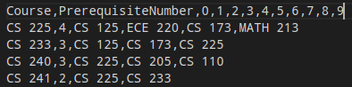
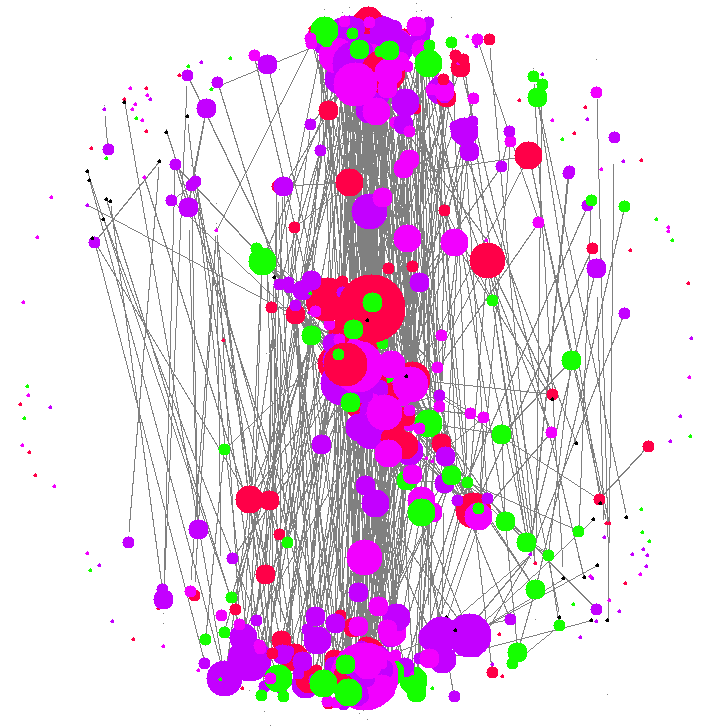
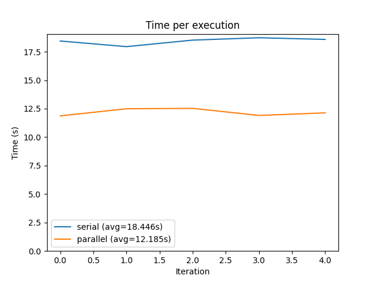

# agbalan2-tvitkin2-hfaroo9-aliceg3
Final Project

## Build/Run
Move into the `src` folder, run `make`, then run `./main` for the main program. Follow the instructions given to produce the output image or run the BFS or Floyd–Warshall algorithm.
**If you run into compilation issues where it can't find `*.o` files, run `make clean` then rerun the `make` command.**
To test, move into the `src` folder and run `make test`. Afterwards, run `./test`. Note that running `./test` may take a while simply due to the nature of some of our algorithms (notably the Floyd–Warshall algorithm and force directed graph) and their time complexities, especially given the size of our test dataset. This may take around 5 minutes to finish running all tests.

To see the performance differences between the parallel and serial versions of the force directed graph output, first build the program by running `make` in `src`, then run the `graph.py` file by running `python graph.py`. An output image graphing the runtimes of 10 iterations of each version will then be outputted as `compare.png`.

## Final Project Video
Link: https://www.youtube.com/watch?v=j2JvqSQBrVg

## Input Data Format
View the sample CSV files located in `src/Data` for reference.

The first line of the CSV must be `Course,PrerequisiteNumber,0,1,2,3,4,5,6,7,8,9` with the following lines all containing a course along with pre-requsite courses. These courses must be in the format `COURSE,NUM_OF_PREREQS,PREREQ_1,PREREQ_2,...` where `...` is the continuation of comma separated pre-reqs (up to 10 total) and `NUM_OF_PREREQS` is the number of pre-reqs of the given course. The `COURSE` and all `PREREQ_N` strings must be in the format `DEPARTMENT 123` where department is the department of the course (ie. ECE, CS, etc) followed by a space and then the number of the course (ie. 225, 391, etc.). A short sample of what a valid CSV file looks like is also shown below: 

  

## Sample Output

  

Key - Red = CS, dark purple = ECE, orange = PHYS, light purple = MATH, black = other

The size of the vertex circle is proportional to the amount of pre-req's that course has 

### Video
To view a video of the progress of the force directed graph after every 10 iterations (up to the default 1000), [click here](https://drive.google.com/file/d/1mLWBelSP-glvxhf6Xs7jIjDdZR-e5StA/view?usp=sharing
).

## Serial vs Parallel
We noticed that there was an opportunity to parallelize some of the code for the force directed algorithm, specifically figuring out the forces needed (attractive, spring, central) every iteration for each vertex. We decided to implement both a parallel and serial version of this algorithm, and as seen in the graph below, we saw approximately a 34% speedup using the parallel implementation.

  

