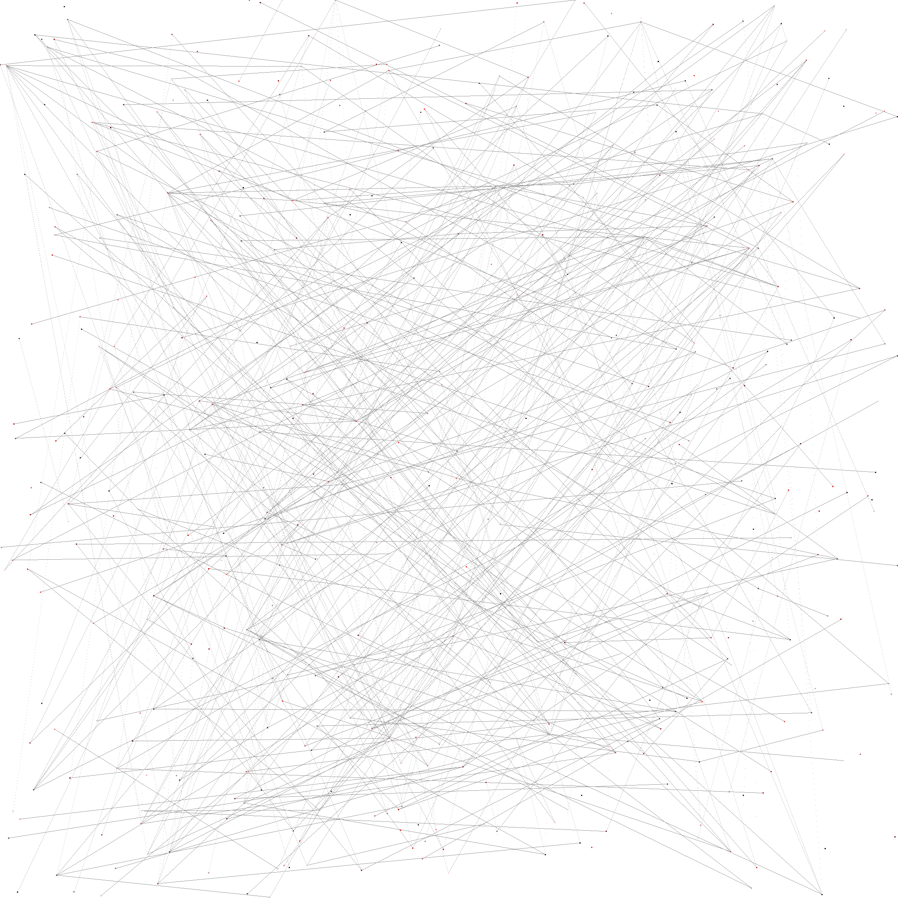
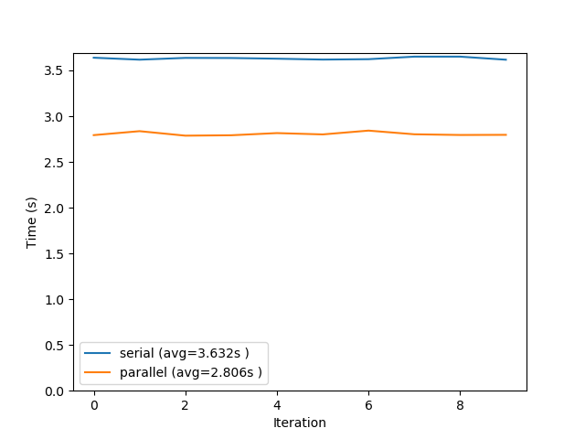

# CS225-UIUC-Class-Graph
Final Project

## Build/Run
Move into the `src` folder, run `make`, then run `./main [argument]` where argument is `0` for the serial version of the force directed graph and `1` is the parellel version.

## Sample Output

  

## Serial vs Parallel

  

